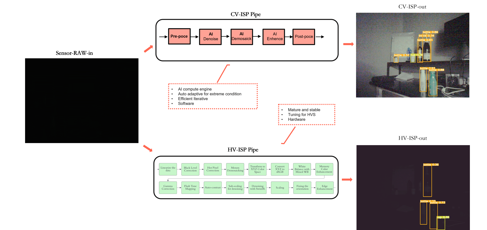

# CV-ISP:NN based ISP for extreme CV-tasks 


## **项目大纲**

- [Project](https://huiiji.github.io/CV-ISP/)

## **Denpendency**

git clone地址
```
git clone git@github.com:752413464/GAN_.py.git
cd GAN_
```
起一个虚拟环境，配置torch，torchvision等库（**以下命令需要先安装好Anaconda**）
```
conda create -n CV_ISP_demo python=3.7
conda activate CV_ISP_demo
conda install pytorch=1.7.0 torchvision=0.8.1 cudatoolkit=11.0 -c pytorch
```
配置好torch等框架，安装一些常用的cv视觉库。
```
pip install matplotlib scikit-image opencv-python tqdm 
```
或者可以直接安装requirements.txt
```
pip install -r requirements.txt
``` 

## Training and Evaluation
Training is not available here, but it's useful to refer to train.py.

## Results
Experiments are performed for different image processing tasks including, image deblurring, image deraining and image denoising. 

## Citation
If you use CV-ISP, please consider citing:

    <!-- @inproceedings{
        title={CV-ISP},
        author={Hui Ji ..},
        year={2023}
    } -->

## Contact
Should you have any question, please contact me.

## My Related Works
- JCAD 2022, Hazy Image Dehazing Algorithm Based on Two Branch Residual Feature Fusion. [Paper](https://www.jcad.cn/cn/article/doi/10.3724/SP.J.1089.2023.19275) | [Code](https://github.com/HuiiJi/Solve-vision-tasks-with-one-click)
